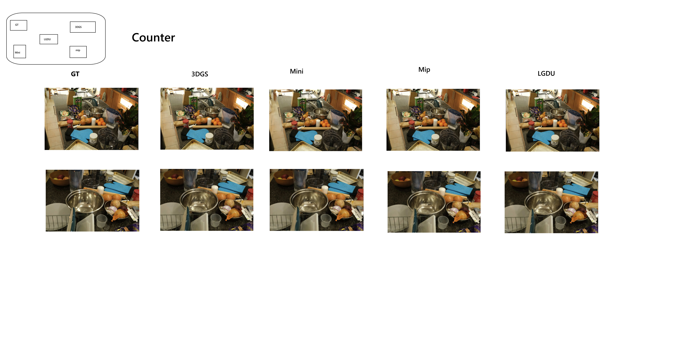
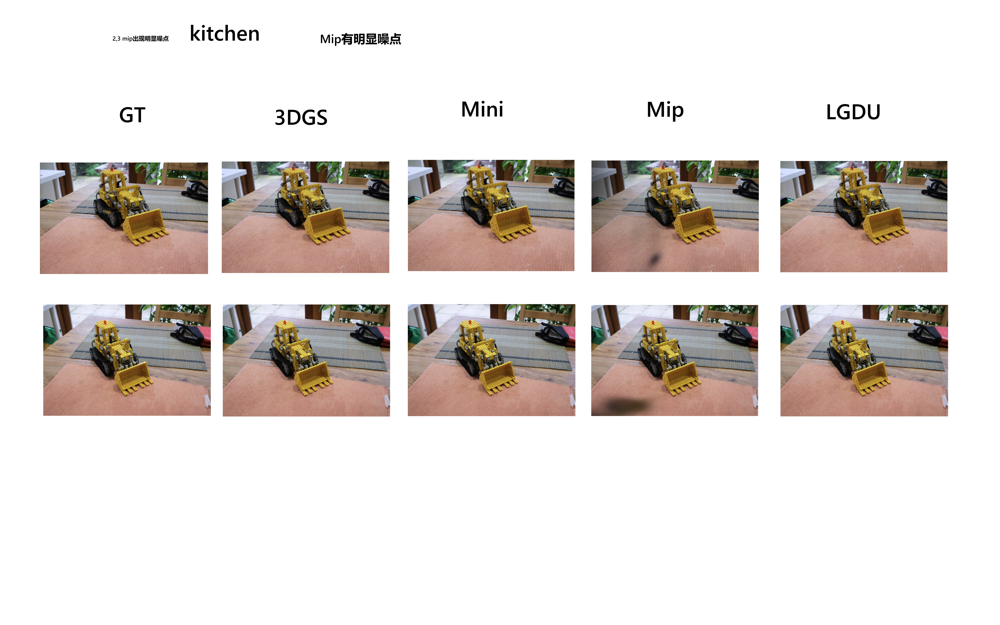
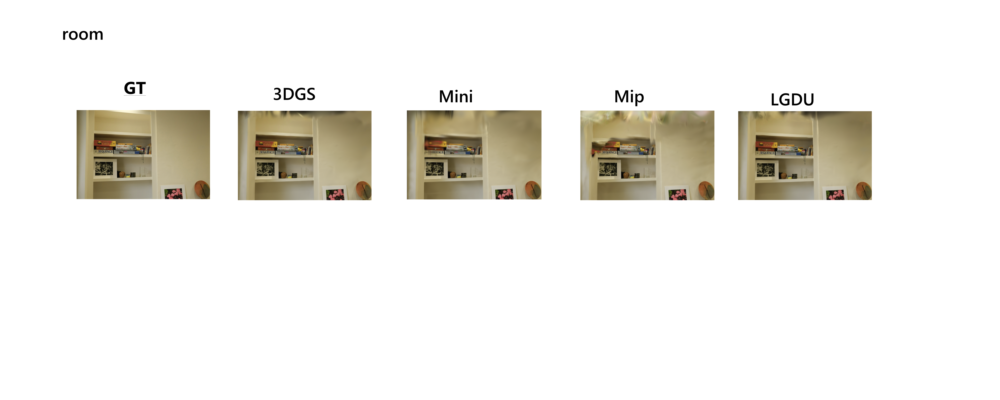

# LGDU-Splatting

**Line-Guided Densification and Unpooling for 3D Gaussian Splatting**

LGDU-Splatting is a research fork of [3D Gaussian Splatting](https://github.com/graphdeco-inria/gaussian-splatting). It studies how reliable 3D line structures from LIMAP can guide Gaussian growth, repair reconstruction failures, and preserve or enhance the global rendering quality of 3DGS.

The current main method combines:

```text
edge-verified line confidence
+ projected line photometric reweighting
+ line-aware densification score
+ line-guided unpooling
```

Unlike early LineSplat variants that directly pulled Gaussian centers toward noisy 3D line segments, LGDU uses verified line tracks as a structural signal for **where Gaussians should densify or be newly inserted**.

## Method Overview

LGDU-Splatting uses the following pipeline:

1. LIMAP extracts 3D line tracks from a COLMAP reconstruction.
2. Line confidence is estimated from visibility and multi-view image-edge support.
3. Verified projected line regions receive confidence-aware photometric supervision.
4. During densification, Gaussians near reliable line structures receive a soft score boost.
5. Line-guided unpooling inserts new Gaussians along reliable line segments in sparse or low-opacity regions.

The recommended method is the **LGDU Core** configuration. Later modules such as SMip, Gaussian-refined confidence, PixelGap, and gated PixelGap are retained as experimental variants and ablations, but are not the current main method.

| Component | Status |
|---|---|
| LIMAP `alltracks.txt` line loading | Implemented |
| Visibility-aware line confidence | Implemented |
| Multi-view edge verification | Implemented |
| Projected line photometric reweighting | Implemented |
| Line-aware densification score | Implemented |
| Line-guided unpooling | Implemented |
| 7-scene global comparison with Mini-Splatting and Mip-Splatting | Updated |
| 6-scene qualitative comparison atlas | Added |

## Repository Layout

Important files added or modified for LGDU:

```text
train.py                         # 3DGS training with line-guided losses, densification, and unpooling
scene/gaussian_model.py          # Line-aware densification and line-guided unpooling
utils/line_utils.py              # LIMAP/OBJ loading, confidence, projected masks, edge support
arguments/__init__.py            # LGDU command-line arguments
metrics_stream.py                # Streaming PSNR/SSIM/LPIPS evaluator
check_init_ply.py                # Utility for checking initial point cloud state
scene/dataset_readers.py         # Dataset reading adjustments
assets/comparisons/              # Latest qualitative comparison figures
```

Original 3DGS files and license are retained. See [LICENSE.md](LICENSE.md).

## Requirements

The base environment follows 3DGS. The local experiments used an environment named `3DGS`.

```bash
conda env create --file environment.yml
conda activate 3DGS
```

OpenCV is required for edge-supported line confidence. LIMAP is used in a separate environment named `Limap` in the local experiments.

Required scene format:

```text
<scene>/
  images/
  sparse/0/
    cameras.bin
    images.bin
    points3D.bin
```

Required LIMAP output:

```text
<limap_output>/alltracks.txt
```

`triangulated_lines_*.obj` is useful for visualization, but LGDU training uses `alltracks.txt` because it contains track-level visibility information.

## Generate LIMAP Lines

```bash
conda activate Limap

cd "/path/to/limap"

python runners/colmap_triangulation.py \
  -a "$(which colmap)" \
  -m "/path/to/scene/sparse/0" \
  -i "/path/to/scene/images" \
  --max_image_dim 1280 \
  -nv 6 \
  --output_dir "/path/to/limap/outputs/scene_nv6"
```

Important: `-c` / `--config_file` is for a YAML config file. Use `--output_dir` for the output folder.

## Train LGDU-Splatting

The following is the recommended **LGDU Core** configuration:

```bash
conda activate 3DGS

cd "/path/to/LGDU-splatting"

PYTORCH_CUDA_ALLOC_CONF=expandable_segments:True python train.py \
  --source_path "/path/to/scene" \
  --model_path "/path/to/output/lgdu_nv6" \
  --eval \
  --disable_viewer \
  --data_device cpu \
  --resolution <R> \
  --test_iterations -1 \
  --checkpoint_iterations 7000 15000 30000 \
  --densify_max_points_per_stage 0 \
  --line_tracks_path "/path/to/limap/outputs/scene_nv6/alltracks.txt" \
  --line_min_visible_views 6 \
  --line_confidence_mode visibility \
  --line_confidence_power 1.0 \
  --line_confidence_min 0.05 \
  --line_multiview_edge_support_enable \
  --line_multiview_edge_max_views 32 \
  --line_multiview_edge_min_views 2 \
  --line_confidence_percentile 70 \
  --line_edge_sigma_px 2.0 \
  --line_edge_sample_count 16 \
  --line_edge_min_valid_ratio 0.5 \
  --line_edge_min_projected_length 4.0 \
  --line_photo_reweight_enable \
  --line_photo_lambda_adaptive \
  --line_photo_lambda_target_ratio 0.03 \
  --line_photo_lambda_adaptive_min 0.0 \
  --line_photo_lambda_adaptive_max 0.02 \
  --line_photo_start_iter 3000 \
  --line_photo_end_iter 15000 \
  --line_photo_sample_count 32 \
  --line_photo_mask_dilation_px 2 \
  --line_photo_min_valid_ratio 0.5 \
  --line_photo_min_projected_length 4.0 \
  --line_photo_charbonnier_eps 0.001 \
  --line_densify_mode score \
  --line_densify_start_iter 500 \
  --line_densify_end_iter 15000 \
  --line_densify_score_boost 0.5 \
  --line_densify_confidence_power 1.0 \
  --line_densify_confidence_max 3.0 \
  --line_densify_low_alpha_boost 0.5 \
  --line_unpool_enable \
  --line_unpool_start_iter 3000 \
  --line_unpool_end_iter 12000 \
  --line_unpool_interval 500 \
  --line_unpool_samples_per_line 2 \
  --line_unpool_max_points 512 \
  --line_unpool_candidate_factor 4 \
  --line_unpool_score_threshold 0.10 \
  --line_unpool_opacity_init 0.04 \
  --line_unpool_scale_factor 0.6 \
  --line_unpool_alpha_target 0.08 \
  --line_unpool_low_alpha_boost 0.5
```

Use the same `--resolution` as the 3DGS, Mini-Splatting, and Mip-Splatting baselines for a fair comparison.

## Render

```bash
conda activate 3DGS

cd "/path/to/LGDU-splatting"

python render.py \
  -s "/path/to/scene" \
  -m "/path/to/output/lgdu_nv6" \
  --iteration 30000 \
  --skip_train \
  --resolution <R> \
  --data_device cpu
```

The metrics script expects:

```text
<model_path>/test/ours_30000/renders/
<model_path>/test/ours_30000/gt/
```

## Evaluation

```bash
conda activate 3DGS

cd "/path/to/LGDU-splatting"

python metrics_stream.py \
  --split test \
  -m "/path/to/3dgs_baseline" \
     "/path/to/mini_splatting" \
     "/path/to/mip_splatting" \
     "/path/to/lgdu"
```

- PSNR: higher is better.
- SSIM: higher is better.
- LPIPS: lower is better.

## Experiment Summary

The latest comparison covers seven scenes from Mip-NeRF 360, Deep Blending, and Tanks and Temples. All methods use the same scene, official test split, resolution, and 30k-iteration evaluation setting.

```text
3DGS: vanilla 3D Gaussian Splatting
Mini: Mini-Splatting
Mip : Mip-Splatting
LGDU: LGDU Core, the current main method
```

### Dataset-Level Average Metrics

| Dataset | Method | PSNR | SSIM | LPIPS |
|---|---|---:|---:|---:|
| Mip-NeRF 360 | 3DGS | 31.8791 | 0.95134 | 0.05946 |
| Mip-NeRF 360 | Mini | 30.8034 | 0.93751 | 0.07767 |
| Mip-NeRF 360 | Mip | 31.8446 | 0.95158 | **0.05745** |
| Mip-NeRF 360 | LGDU | **32.0735** | **0.95268** | 0.05896 |
| Deep Blending | 3DGS | 30.0636 | 0.91981 | 0.13809 |
| Deep Blending | Mini | **30.2383** | 0.91963 | 0.15458 |
| Deep Blending | Mip | 29.7298 | 0.91533 | 0.14317 |
| Deep Blending | LGDU | 30.1914 | **0.92619** | **0.13714** |
| Tanks and Temples | 3DGS | 24.0991 | 0.87614 | 0.13318 |
| Tanks and Temples | Mini | 23.5904 | 0.85712 | 0.16540 |
| Tanks and Temples | Mip | 24.1167 | 0.88269 | **0.12209** |
| Tanks and Temples | LGDU | **24.1859** | **0.88490** | 0.13011 |

Mip-NeRF 360 averages use `counter`, `kitchen`, and `room`; Deep Blending averages use `drjohnson` and `playroom`; Tanks and Temples averages use `truck` and `train`.

### Per-Scene Global Metrics

| Scene | Method | PSNR | SSIM | LPIPS |
|---|---|---:|---:|---:|
| counter | 3DGS | 30.3106 | 0.94141 | 0.06218 |
| counter | Mini | 29.2275 | 0.92343 | 0.08112 |
| counter | Mip | 30.3475 | 0.94315 | **0.05832** |
| counter | LGDU | **30.4556** | **0.94376** | 0.06201 |
| kitchen | 3DGS | 32.1701 | 0.94846 | 0.06685 |
| kitchen | Mini | 31.0743 | 0.93358 | 0.08861 |
| kitchen | Mip | 31.9186 | 0.94843 | **0.06381** |
| kitchen | LGDU | **32.4697** | **0.94934** | 0.06613 |
| room | 3DGS | 33.1566 | 0.96414 | 0.04934 |
| room | Mini | 32.1084 | 0.95551 | 0.06329 |
| room | Mip | 33.2677 | 0.96315 | 0.05022 |
| room | LGDU | **33.2952** | **0.96493** | **0.04874** |
| truck | 3DGS | 25.5370 | 0.88511 | 0.14174 |
| truck | Mini | 25.1162 | 0.87396 | 0.15896 |
| truck | Mip | **25.6489** | 0.89245 | **0.12324** |
| truck | LGDU | 25.5466 | **0.89555** | 0.13933 |
| drjohnson | 3DGS | 29.6548 | 0.91286 | 0.13901 |
| drjohnson | Mini | 29.7897 | 0.91110 | 0.15960 |
| drjohnson | Mip | 28.9141 | 0.90432 | 0.15175 |
| drjohnson | LGDU | **29.8431** | **0.92374** | **0.13807** |
| train | 3DGS | 22.6612 | 0.86717 | 0.12462 |
| train | Mini | 22.0646 | 0.84028 | 0.17184 |
| train | Mip | 22.5844 | 0.87292 | 0.12094 |
| train | LGDU | **22.8251** | **0.87425** | **0.12089** |
| playroom | 3DGS | 30.4723 | 0.92675 | 0.13717 |
| playroom | Mini | **30.6869** | 0.92816 | 0.14955 |
| playroom | Mip | 30.5454 | 0.92634 | **0.13459** |
| playroom | LGDU | 30.5397 | **0.92864** | 0.13621 |

### Seven-Scene Average

| Method | PSNR | SSIM | LPIPS |
|---|---:|---:|---:|
| 3DGS | 29.1375 | 0.92084 | 0.10299 |
| Mini | 28.5811 | 0.90943 | 0.12471 |
| Mip | 29.0324 | 0.92154 | **0.10041** |
| LGDU | **29.2821** | **0.92574** | 0.10163 |

LGDU achieves the best seven-scene average PSNR and SSIM, while Mip-Splatting achieves the best average LPIPS.

### LGDU vs 3DGS Global Delta

| Scene | Delta PSNR | Delta SSIM | Delta LPIPS |
|---|---:|---:|---:|
| counter | +0.1450 | +0.00235 | -0.00017 |
| kitchen | +0.2996 | +0.00088 | -0.00072 |
| room | +0.1386 | +0.00079 | -0.00060 |
| truck | +0.0096 | +0.01044 | -0.00241 |
| drjohnson | +0.1883 | +0.01088 | -0.00094 |
| train | +0.1639 | +0.00708 | -0.00373 |
| playroom | +0.0674 | +0.00189 | -0.00096 |

Negative LPIPS deltas indicate improvement. With the latest results, LGDU improves all three global metrics over 3DGS on all seven scenes.

### Qualitative Comparisons

Each figure compares GT, 3DGS, Mini-Splatting, Mip-Splatting, and LGDU using the latest comparison atlas.

#### Counter



#### Dr. Johnson


#### Kitchen



#### Playroom


#### Room



#### Train


## Current Conclusion

The latest seven-scene comparison shows:

- LGDU improves global PSNR, SSIM, and LPIPS over vanilla 3DGS on all seven scenes.
- LGDU obtains the best PSNR on five scenes and the best SSIM on all seven scenes.
- LGDU achieves the best seven-scene average PSNR and SSIM.
- Mip-Splatting remains the strongest baseline for average LPIPS.
- SMip, GRef, PixelGap, and gated PixelGap remain useful ablations, while LGDU Core is the cleanest and most stable paper main line.

```text
LGDU-Splatting improves the global rendering quality of vanilla 3DGS across
all evaluated scenes while remaining competitive with Mini-Splatting and
Mip-Splatting.
```

## Git Remotes

This local fork uses:

```text
origin   https://github.com/Ddsmmmm/LGDU-splatting.git
```

## Citation and License

This project is derived from 3D Gaussian Splatting. The original license is retained in [LICENSE.md](LICENSE.md).

If you use this repository, cite the original 3DGS paper:

```bibtex
@Article{kerbl3Dgaussians,
  author  = {Kerbl, Bernhard and Kopanas, Georgios and Leimkuehler, Thomas and Drettakis, George},
  title   = {3D Gaussian Splatting for Real-Time Radiance Field Rendering},
  journal = {ACM Transactions on Graphics},
  number  = {4},
  volume  = {42},
  month   = {July},
  year    = {2023},
  url     = {https://repo-sam.inria.fr/fungraph/3d-gaussian-splatting/}
}
```
